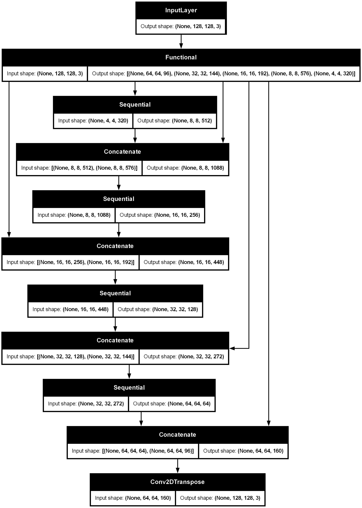
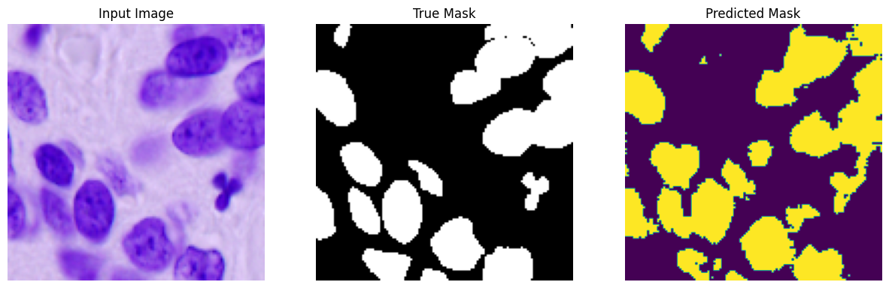
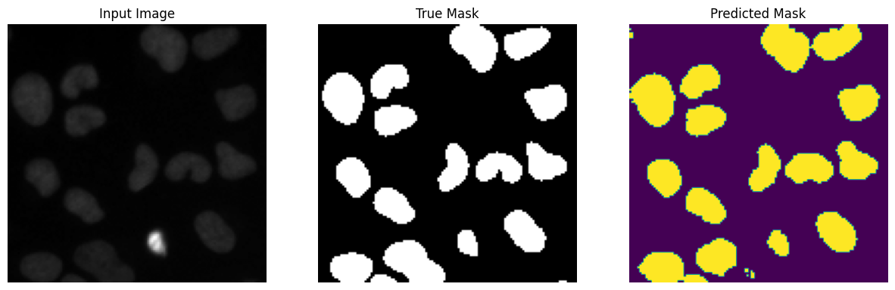
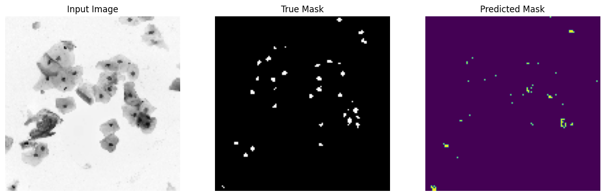
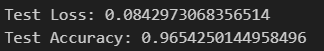

# Cell Nuclei Semantic Segmentation
This project focuses on semantic segmentation of cell nuclei from microscopy images. It uses U-Net architecture with MobileNetV2 as the backbone, leveraging transfer learning to improve performance. The goal is to automate the identification and delineation of cell nuclei to assist in biological research and medical diagnostics.

## Project Overview

Cell nuclei segmentation is a critical task in computational biology. This project leverages **U-Net** with a **MobileNetV2** backbone for efficient feature extraction through transfer learning. The model has both a **downsampling** path for feature extraction and an **upsampling** path for precise segmentation.

**Applications:**
- Cancer diagnosis and prognosis
- Drug discovery
- Cellular behavior studies

## Features
- Preprocessing pipeline for microscopy images.
- U-Net architecture with MobileNetV2 as the encoder.
- Downsampling path using MobileNetV2 features.
- Upsampling path for accurate segmentation masks.
- Training, validation, and testing scripts.
- Visualization of segmentation results.

# Model Architecture
The model architecture follows the U-Net design with a MobileNetV2 backbone for feature extraction, which is used for the downsampling path. The encoder (downsampling path) captures high-level features, while the upsampling path restores spatial dimensions for precise segmentation masks.

**Downsampling Path (Encoder):**
- MobileNetV2 serves as the encoder, utilizing its pre-trained weights from ImageNet to extract hierarchical features.
- MobileNetV2's depthwise separable convolutions allow for an efficient and lightweight feature extraction process.

**Upsampling Path (Decoder):**
- After the downsampling path, the decoder progressively upsamples the feature maps to restore the original image dimensions.
- Skip connections from the encoder to the decoder help maintain high-resolution features during upsampling, improving segmentation accuracy.

**Model Architecture Diagram**

# Instruction
1. Download the dataset from this [link](https://shrdc-my.sharepoint.com/personal/kong_kah_chun_shrdc_org_my/_layouts/15/onedrive.aspx?id=%2Fpersonal%2Fkong_kah_chun_shrdc_org_my%2FDocuments%2FDeep%20Learning%20TTT%2FImage%20Segmentation%2FData%2Fdata-science-bowl-2018%2Ezip&parent=%2Fpersonal%2Fkong_kah_chun_shrdc_org_my%2FDocuments%2FDeep%20Learning%20TTT%2FImage%20Segmentation%2FData&ga=1)
2. Make a folder called "datasets" into the repository if there's none
3. Unzip the content of the zip file into the datasets folder.
4. Run the notebook file sequentially from top to bottom.

# Result

**Color Based Cell**

**Faded Cell**

**Tiny Nuclei**

# Metric

# Dataset
The project uses publicly available datasets like the Data Science Bowl 2018 dataset. You can download it from [Kaggle](https://www.kaggle.com/competitions/data-science-bowl-2018/overview).

